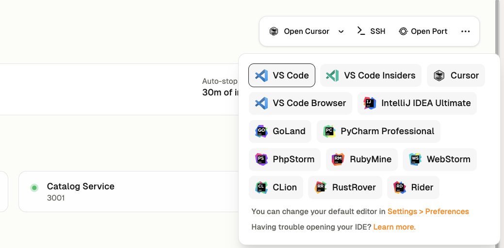

# Welcome to GitpodFlix! 🎬

Hey there new developer! 👋

Welcome to GitpodFlix, where we're providing the next generation of streaming experiences.

We're thrilled you joined let's get you shipping today !

### At GitpodFlix: we ship to production on your first day

We know happy developers that are in flow create better products and ship more value.

At GitpodFlix we have **zero "works on my machine" issues** because of **Gitpod**. Onboarding is **one-click to get a running environment with everything you need to ship new fixes and features today** which is why:

We expect every new developer to **ship to production on their first day**.

## Starting your development environment

1. **Check your email**
    * You should have an email invite to join the GitpodFlix organization
    * And a link for your first GitHub issue.
3. **Go to the projects catalog**
    * Find it at: [app.gitpod.io/projects](https://app.gitpod.io/projects)
    * Here is every project in GitpodFlix that you have access to.
5. **Open up GitpodFlix**
    * Search "GitpodFlix" in the list and click **"Create environment"**

And bingo! Now have your first environment up and running—that was easy.


See above you now have:

1. A personal, isolated, secure, performant development environment
1. All required source code cloned and authenticated with git
1. Any secrets and access credentials installed ready-to-go
1. Your database, microservices and web server running (via "automations")
1. All your dependencies installed from node to sqlite

## Making a code change

Now in the top right you can choose your favourite editor, whether that's IntelliJ, VS Code or even Cursor.



Your environment will automatically connect.


Here you have:

- All the source code in your favourite editor
- Your running web server on `localhost:3000`
- Your running ports for your API, database, etc
- All authenticated with your GitHub account
- A powerful environment secure in your corporate network

> **Tip:** Let's rename "Gitpod Flix" to our name by updating `frontend/src/components/Navbar.jsx`. <br/> Watch the web server live reload the change.

Now you're officially **ready-to-code**.

### Explore your development environment

Now you're setup why not explore:

1. Running a database clear and seed "automation" from the Gitpod UI
2. Connecting to your environment with the CLI `gitpod environment ssh`
3. Adding dotfiles for your personal preferences

## ✨ How does this Gitpod magic work?

### Dev Container

All of the dependencies are defined in the `devcontainer.json` file. Your platform team has configured a base image with all of your platform tooling ready to go. Any time platform tooling updates the next environment you open will automatically have the latest tooling.

Here's a simplified version of how that looks:

```json
{
  "name": "GitpodFlix Dev Environment",
  "image": "mcr.microsoft.com/devcontainers/base:ubuntu",
  "features": {
    "ghcr.io/devcontainers/features/node:1": {},
    "ghcr.io/warrenbuckley/codespace-features/sqlite:1": {}
  },
  "forwardPorts": [
    3000,
    ...
  ],
  "postCreateCommand": ".devcontainer/setup.sh",
  "customizations": {
    "vscode": {
      "extensions": [
        "dbaeumer.vscode-eslint",
        ...
      ]
    }
  }
}
```

This includes:

1. Dependencies like SQLite and Node.JS
2. Configurations of ports to forward
3. A script for additional dependencies and setup
4. Customizations for your editor

### Automations

Your team have configured automations in `.gitpod/automations.yaml`.

Here's a simplified version of how that looks:

```yaml
services:
  catalog:
    name: "GitpodFlix Web Server"
    triggeredBy:
      - postEnvironmentStart
    commands:
      start: |
        cd /workspaces/flex-demo/frontend
        PORT=3001 npx nodemon src/index.ts

tasks:
  seedDatabase:
    name: "Seed Database"
    description: "Seed the database with sample movies in a dramatic sequence"
    triggeredBy:
      - manual
      - postEnvironmentStart
    command: |
      PGPASSWORD=gitpod psql -h localhost -U gitpod -d gitpodflix -f seeds/01_seed_trending.sql
```

This includes:

- Configurations to start your webservers, databases and microservices
- Automated tasks to seed your database, run tests, etc

All of these are setup to be self-serve and automatically configured. **If anything every breaks, simply delete your environment and create a new one.**

## FAQs

### Where is my environment running? 

Environments run locally or remotely for different projects with different needs. 

### Can I run multiple environment at once?

Yes. The platform team have set policies to manage cost of remote environments. 

### Can I clone multiple repositories

Yes.

### Can I customize my environment?

Yes, with dotfiles. 

### Can environments run locally? 

Yes for some projects with lower security requirements—but not for others. 

### What happens if the environment stops?

Your code is saved—simply restart to continue working.

### Can I connect via SSH for Vim, etc?

Yes via the Gitpod CLI.

### How do I increase my machine size?

Projects are configured with a specific machine size that's perfect to use. 
